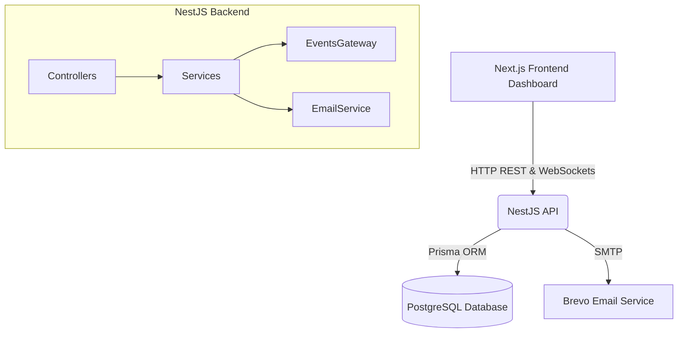

# 🚗 Instant Mechanic — Full Stack Operations Platform & API

This repository contains the complete codebase for the **Instant Mechanic** platform, including both the **NestJS Backend API** and the **Next.js 14+ Operations Control Center** frontend.

```
trial/
├── src/                    ← NestJS Backend API & Database Services
├── test/                   ← Backend E2E & Unit Tests
├── Dockerfile              ← Backend Container Spec
├── docker-compose.yml
│
└── frontend/               ← Next.js 14+ Frontend Operations Platform
    ├── src/
    │   ├── app/            ← App Router Pages (/login, /dashboard/overview, /bookings, /mechanics, /map, /settings)
    │   ├── components/     ← Layout, Dashboard, Bookings, Mechanics, Customers, Charts, UI
    │   ├── services/       ← Native fetch api.ts & Service Layer
    │   ├── types/          ← Centralized TypeScript Interfaces
    │   └── mocks/          ← Isolated Mock Adapter & Seed Dataset
    ├── README.md           ← Detailed Frontend Documentation
    └── package.json
```

---

## ⚡ Project Overview

Instant Mechanic is a comprehensive platform designed to connect vehicle owners in need of repairs with available field mechanics in real time. Built with enterprise-grade architecture:
- **Shop Admins** monitor live dispatches, city-wide mechanics, booking statuses, and network revenue.
- **Mechanics** receive real-time job assignments on the field.
- **Customers** book and track their vehicle repair requests seamlessly.

---

## 🛠 Tech Stack

### Frontend (Operations Control Center)
- **Framework:** Next.js 14+ (App Router, React 18, TypeScript)
- **Styling:** Vanilla CSS & TailwindCSS with custom design system (`#F98513` brand orange, `#FAF7F1` warm canvas)
- **Typography:** Google Fonts (**Outfit** & **Plus Jakarta Sans**)
- **Data Visualization:** Recharts
- **Icons:** Lucide React

### Backend (API & Services)
- **Backend Framework:** NestJS (Node.js/TypeScript)
- **Database:** PostgreSQL (Optimized for Supabase)
- **ORM:** Prisma
- **Authentication:** Passport.js (JWT, bcrypt)
- **Real-time Engine:** Socket.IO
- **Validation:** class-validator & class-transformer
- **Email Notifications:** Brevo (via Nodemailer)
- **Infrastructure:** Docker & Docker Compose
- **Documentation:** Swagger / OpenAPI

---

## 🏗 Architecture



1. **Frontend** interacts with the **API** via standardized REST endpoints (protected by JWT authentication).
2. The **API** orchestrates business logic (e.g., safe booking status transitions) and persists data to the **Database**.
3. Real-time updates (like mechanic GPS locations and booking status changes) are broadcast back to the frontend via WebSockets.
4. Important lifecycle events trigger transactional emails via Brevo.

---

## 🚀 Quick Start — Frontend

```bash
# 1. Navigate to the frontend directory
cd frontend

# 2. Install dependencies
npm install

# 3. Start development server
npm run dev
```

Open [http://localhost:3000](http://localhost:3000) to view the live dashboard. Login credentials:
- **Email**: `admin@instantmechanic.com`
- **Password**: `Password123!`

For detailed frontend architecture, environment variables, API schemas, and deployment instructions, refer to [`frontend/README.md`](./frontend/README.md).

---

## ⚙️ Local Setup — Backend

1. **Install dependencies:**
   ```bash
   npm install
   ```
2. **Set up the Database:**
   Start the PostgreSQL instance via Docker:
   ```bash
   docker-compose up -d
   ```
3. **Configure Environment:**
   Copy `.env.example` to `.env` and fill in your secrets.
4. **Sync & Seed the Database:**
   ```bash
   npm run db:push
   npm run db:seed
   ```
5. **Start the Application:**
   ```bash
   npm run start:dev
   ```

---

## 🔑 Environment Variables

Create a `.env` file in the root directory. Required variables:
- `PORT`: Port the server runs on (default: 3000)
- `DATABASE_URL`: Connection string for PostgreSQL (If using Supabase, transaction port 6543)
- `DIRECT_URL`: Direct connection string for PostgreSQL (If using Supabase, session port 5432)
- `JWT_SECRET`: Secret key for signing JWT tokens
- `CORS_ALLOWED_ORIGINS`: Comma-separated list of allowed frontend origins
- `BREVO_SMTP_HOST`: smtp-relay.brevo.com
- `BREVO_SMTP_PORT`: 587
- `BREVO_SMTP_USER`: Your Brevo account email
- `BREVO_SMTP_PASSWORD`: Your Brevo SMTP key
- `BREVO_FROM_EMAIL`: Address emails are sent from

---

## 📚 API Documentation

The API is fully documented using Swagger. Once the server is running locally, visit:
**`http://localhost:3000/api/docs`**

### Major Endpoints
- `POST /api/v1/auth/login`: Authenticate and receive a JWT.
- `GET /api/v1/dashboard/analytics`: Fetch heavy aggregations for admins (top services, revenue, mechanic rankings).
- `GET /api/v1/bookings`: Fetch paginated, searchable, filterable lists of bookings.
- `PATCH /api/v1/bookings/:id/status`: Transition a booking state (triggers WebSockets and Emails).
- `GET /api/v1/bookings/export`: Export filtered bookings to CSV.
- `POST /api/v1/mechanics/:id/location`: Broadcast mechanic GPS updates via WebSockets.

---

## 🐳 Deployment

The application is optimized for containerized cloud deployment.
1. A multi-stage `Dockerfile` handles installing dependencies, building the TypeScript source, and pruning the final image to just the necessary production artifacts.
2. A `docker-compose.prod.yml` orchestrates the Node.js API container alongside a production PostgreSQL container, linked via a private Docker bridge network.
3. Deploy to a VPS (e.g., DigitalOcean, AWS EC2) by cloning the repository, populating `.env.production`, and running `docker-compose -f docker-compose.prod.yml up -d`.

---

## 🤖 AI Usage Disclosure

- **AI Tools Used:** Standard Large Language Models (LLMs) used as pair-programming assistants.
- **Purpose:** Used primarily for generating boilerplate code, scaffolding standard NestJS modules, writing repetitive Prisma schemas, generating database seeding scripts, and iteratively building Next.js components.
- **Significant Generation:** The `faker.js` logic to generate thousands of realistic relationships in `prisma/seed.ts` was largely AI-generated to save time.
- **Personal Implementation:** I personally designed the system architecture, wrote the transactional safety logic in `BookingsService`, configured the Brevo SMTP integration, resolved dependency injection errors, built custom PostgreSQL aggregations for analytics, and curated the frontend design system.
