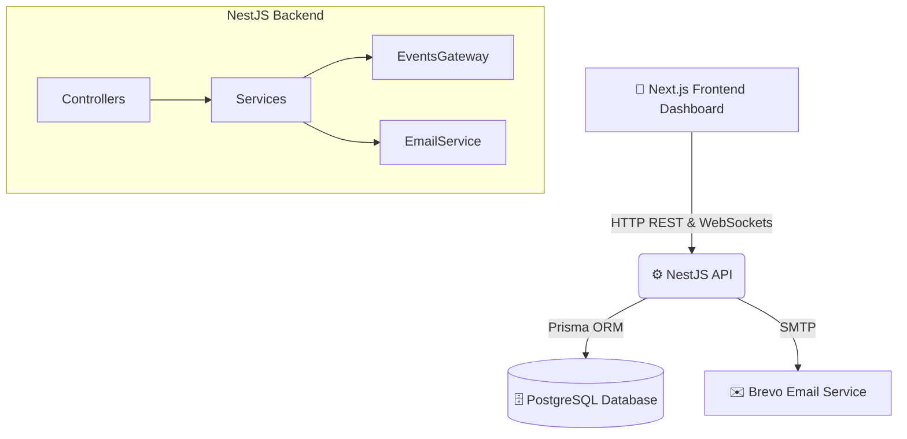

<div align="center">


<br/><br/>

[](https://git.io/typing-svg)

<br/>

Instant Mechanic connects vehicle owners with field mechanics through a production-grade operations platform — built for shop admins to monitor live bookings, dispatch mechanics, and track revenue, all in real time.

<br/>


<br/>

[**🌐 Live Demo**](#) · [**📖 API Docs**](./API_DOCUMENTATION.md) · [**🐳 Backend Repo**](#) · [**🎨 Frontend Setup**](./frontend/README.md)

</div>

---

## 📑 Table of Contents

- [Overview](#-overview)
- [Tech Stack](#-tech-stack)
- [Architecture](#-architecture)
- [Project Structure](#-project-structure)
- [Quick Start — Frontend](#-quick-start--frontend)
- [Local Setup — Backend](#-local-setup--backend)
- [Environment Variables](#-environment-variables)
- [API Documentation](#-api-documentation)
- [Deployment](#-deployment)
- [AI Usage Disclosure](#-ai-usage-disclosure)

---

## ⚡ Overview

Instant Mechanic is a comprehensive platform designed to connect vehicle owners in need of repairs with available field mechanics in real time — built with enterprise-grade architecture across three user surfaces:

| Role | What they do |
|---|---|
| 🧑‍💼 **Shop Admins** | Monitor live dispatches, city-wide mechanics, booking statuses, and network revenue from a single control center |
| 🔧 **Mechanics** | Receive real-time job assignments and update status directly from the field |
| 🚘 **Customers** | Book and track their vehicle repair requests seamlessly |

<br/>

<div align="center">


</div>

---

## 🛠 Tech Stack

<table>
<tr>
<td valign="top" width="50%">

### 🎨 Frontend — Operations Control Center
- **Framework:** Next.js 14+ (App Router, React 18, TypeScript)
- **Styling:** TailwindCSS + custom design system (`#F98513` brand orange, `#FAF7F1` warm canvas)
- **Typography:** Outfit & Plus Jakarta Sans (Google Fonts)
- **Data Viz:** Recharts
- **Icons:** Lucide React

</td>
<td valign="top" width="50%">

### ⚙️ Backend — API & Services
- **Framework:** NestJS (Node.js/TypeScript)
- **Database:** PostgreSQL (Supabase-optimized)
- **ORM:** Prisma
- **Auth:** Passport.js (JWT, bcrypt)
- **Real-time:** Socket.IO
- **Validation:** class-validator / class-transformer
- **Email:** Brevo (via Nodemailer)
- **Docs:** Swagger / OpenAPI

</td>
</tr>
</table>

---

## 🏗 Architecture



**Data flow:**
1. **Frontend** calls the **API** via JWT-protected REST endpoints.
2. The **API** runs business logic (e.g. safe booking status transitions) and persists to **PostgreSQL** via Prisma.
3. Real-time changes — mechanic GPS pings, booking status updates — broadcast back to the frontend over **WebSockets**, no page refresh needed.
4. Key lifecycle events (booking confirmed, completed) trigger transactional emails via **Brevo**.

---

## 📂 Project Structure

```
trial/
├── src/                    ← NestJS Backend API & Database Services
├── test/                   ← Backend E2E & Unit Tests
├── Dockerfile              ← Backend Container Spec
├── docker-compose.yml
│
└── frontend/               ← Next.js 14+ Frontend Operations Platform
    ├── src/
    │   ├── app/             ← /login, /dashboard/overview, /bookings, /mechanics, /map, /settings
    │   ├── components/      ← Layout, Dashboard, Bookings, Mechanics, Customers, Charts, UI
    │   ├── services/        ← Fetch-based API client layer
    │   ├── types/           ← Centralized TypeScript interfaces
    │   └── mocks/            ← Offline mock adapter & seed dataset
    ├── README.md            ← Detailed frontend documentation
    └── package.json
```

---

## 🚀 Quick Start — Frontend

```bash
cd frontend
npm install
npm run dev
```

Open **[http://localhost:3000](http://localhost:3000)**

| Field | Value |
|---|---|
| Email | `admin@instantmechanic.com` |
| Password | `Password123!` |

📖 Full frontend docs: [`frontend/README.md`](./frontend/README.md)

---

## ⚙️ Local Setup — Backend

```bash
# 1. Install dependencies
npm install

# 2. Start PostgreSQL via Docker
docker-compose up -d

# 3. Configure environment
cp .env.example .env    # then fill in your secrets

# 4. Sync & seed the database
npm run db:push
npm run db:seed

# 5. Start the server
npm run start:dev
```

---

## 🔑 Environment Variables

Create a `.env` file in the repo root:

| Variable | Description |
|---|---|
| `PORT` | Server port (default `3000`) |
| `DATABASE_URL` | PostgreSQL connection string (Supabase: transaction pooler, port `6543`) |
| `DIRECT_URL` | Direct PostgreSQL connection (Supabase: session pooler, port `5432`) |
| `JWT_SECRET` | Secret key for signing JWTs |
| `CORS_ALLOWED_ORIGINS` | Comma-separated allowed frontend origins |
| `BREVO_SMTP_HOST` | `smtp-relay.brevo.com` |
| `BREVO_SMTP_PORT` | `587` |
| `BREVO_SMTP_USER` | Your Brevo account email |
| `BREVO_SMTP_PASSWORD` | Your Brevo SMTP key |
| `BREVO_FROM_EMAIL` | Address emails are sent from |

---

## 📚 API Documentation

Full endpoint reference (requests, responses, WebSocket events) lives in **[`API_DOCUMENTATION.md`](./API_DOCUMENTATION.md)**.

Interactive Swagger docs, once the server is running:
**`http://localhost:3000/api/docs`**

<details>
<summary><b>Quick reference — major endpoints</b></summary>
<br/>

| Method | Endpoint | Description |
|---|---|---|
| `POST` | `/api/v1/auth/login` | Authenticate, receive JWT |
| `GET` | `/api/v1/dashboard/analytics` | Aggregated stats: revenue, top services, mechanic rankings |
| `GET` | `/api/v1/bookings` | Paginated, searchable, filterable bookings list |
| `PATCH` | `/api/v1/bookings/:id/status` | Transition booking state (triggers WebSocket + email) |
| `GET` | `/api/v1/bookings/export` | Export filtered bookings to CSV |
| `POST` | `/api/v1/mechanics/:id/location` | Broadcast mechanic GPS update via WebSocket |

</details>

---

## 🐳 Deployment

Optimized for containerized cloud deployment:

1. A multi-stage **Dockerfile** installs dependencies, builds the TypeScript source, and prunes the final image to production-only artifacts.
2. **`docker-compose.prod.yml`** orchestrates the API alongside PostgreSQL over a private Docker bridge network.
3. **Backend:** deployed on AWS Elastic Beanstalk.
4. **Frontend:** deployed on Vercel, connected to the live backend via `NEXT_PUBLIC_API_URL`.
5. **CI:** GitHub Actions verifies both frontend and backend build successfully — and that the Docker image builds cleanly — on every push.

---

## 🤖 AI Usage Disclosure

<div align="center">


</div>

<table>
<tr>
<td width="28%" valign="top">

**🛠️ Tools Used**

</td>
<td>

Claude and ChatGPT, used as pair-programming assistants throughout the build

</td>
</tr>
<tr>
<td valign="top">

**🎯 Used For**

</td>
<td>

Boilerplate generation, scaffolding NestJS modules, Prisma schema drafts, database seed scripts, iterative Next.js component building

</td>
</tr>
<tr>
<td valign="top">

**⚡ Significant AI Generation**

</td>
<td>

`faker.js`-driven logic in `prisma/seed.ts`, generating thousands of realistic relational records

</td>
</tr>
<tr>
<td valign="top">

**👤 Personally Implemented**

</td>
<td>

System architecture design, transactional safety logic in `BookingsService`, Brevo SMTP integration, dependency-injection debugging, custom PostgreSQL analytics aggregations, and the frontend design system

</td>
</tr>
</table>

---

<div align="center">

Built for the **Instant Mechanic Full Stack Developer Internship** challenge 🚗

</div>
